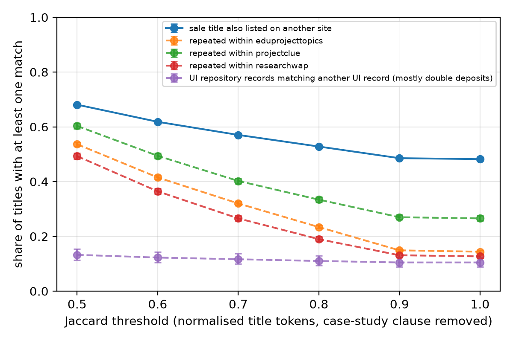

# Topic recycling in Nigerian project-topic sale catalogues

A measurement study of how much the catalogues of Nigerian "project topics and materials"
websites overlap with each other, and with theses deposited in a university repository.

**Status (2026-09-17):** harvest, matching and two-annotator labelling complete.

## Data

| Source | What | Titles harvested | Titles analysed (at least 4 content words) |
|---|---|---|---|
| projectclue.com | public sitemap | 9,102 | 9,006 |
| researchwap.com | public sitemap | 8,195 | 8,111 |
| eduprojecttopics.com | public product sitemaps | 20,859 | 20,259 |
| repository.ui.edu.ng | OAI-PMH, items typed Thesis or Dissertation | 1,131 | 1,118 |

projectng.com (42,886 listings) was harvested but excluded from headline numbers because its
URL slugs drop stopwords and truncate titles. premiumresearchers.com was excluded because its
robots.txt disallows AI crawlers. Details in [ETHICS.md](ETHICS.md).

## Method

1. Normalise titles: ASCII fold, lowercase, remove punctuation, stopwords and plural endings.
   A second view (`core`) also removes a trailing case-study clause, so a topic resold with a
   different bank or state still matches.
2. MinHash (64 permutations) with LSH banding (16 bands of 4) proposes candidate pairs.
3. Every candidate is scored by **exact** Jaccard on token sets. LSH affects recall only.
4. A title "has a match" in a group if any other title there scores at or above the threshold.
   Rates carry Wilson 95% intervals.
5. A stratified sample of 200 cross-source pairs (40 per Jaccard band) is labelled independently
   by two annotators ([LABELLING.md](LABELLING.md)) to estimate precision per band. Band order is
   shuffled and the similarity score is hidden from the labeller.

## Results so far

All numbers come from `results/summary.json` (full view unless stated).

**Matcher precision (200 pairs, two annotators).** From `results/precision.json`:

| Threshold | Precision (agreed pairs) | Precision (disagreements counted wrong) | Annotator agreement in band |
|---|---|---|---|
| >= 0.9 | 1.000 (0.910 to 1.000) | 0.974 (0.868 to 0.995) | 97.4% |
| >= 0.8 | 0.987 (0.931 to 0.998) | 0.962 (0.894 to 0.987) | 97.5% |
| >= 0.7 | 0.972 (0.921 to 0.991) | 0.874 (0.802 to 0.922) | 75.0% |
| >= 0.6 | 0.898 (0.836 to 0.938) | 0.767 (0.696 to 0.826) | 72.5% |
| >= 0.5 | 0.817 (0.751 to 0.869) | 0.668 (0.600 to 0.730) | 67.5% |

Overall agreement was 81.9% (Cohen's kappa 0.507, n=199), but that single figure hides the
pattern that matters: the annotators disagreed on 13, 11 and 10 of 40 pairs in the 0.5, 0.6 and
0.7 bands, and on 1 of 40 and 1 of 39 in the 0.8 and 0.9 bands. **Jaccard 0.8 is therefore the
operating threshold**; below it, humans cannot agree either, so the matcher is not the limitation.
Kappa is also depressed at high bands because almost every pair there is a true match, which
leaves little variance for chance correction.

**Cross-site overlap.** At the 0.8 operating threshold, **44.8% of sale listings (95% CI 44.3 to
45.3; 16,752 of 37,376) have a same-topic match on another sale site**, and 52.8% in the `core`
view. Discounting by the conservative precision at that threshold gives roughly 43% as a floor.
40.3% (CI 39.8 to 40.8) have an *identical* normalised title elsewhere, which needs no labelling
at all.

**Consolidation.** Joining listings at Jaccard 0.9 or above, 37,376 listings collapse to 27,325
distinct titles. 4,957 are listed on two sites and 1,164 on all three.

**Repeats within a site.** 16.2% of projectclue, 12.8% of eduprojecttopics and 9.9% of
researchwap listings have an identical normalised title elsewhere on the same site.

**Repository against catalogues.** Only 4 distinct University of Ibadan theses (5 records,
0.45% of 1,118; CI 0.19 to 1.04) match a sale title at Jaccard 0.8. The overlap is small, most
likely because the repository holds mainly postgraduate theses while the catalogues sell mainly
undergraduate topics. The 4 matches are highly specific 2014 thesis titles listed verbatim on
researchwap (for example a pragmatics study of named plays), which is consistent with deposited
theses being resold, but 4 cases cannot support a rate.



## Limitations

- A title match shows topic reuse, not that any student submitted purchased work, and not the
  direction of copying.
- Repeats within a site include the same project cross-listed under two departments, which is
  not recycling. These have not yet been separated out.
- Sitemap `lastmod` dates are regenerated by the sites and cannot date a listing.
- Titles are reconstructed from URL slugs, which lose punctuation and occasionally words.
- One repository, mostly postgraduate, is a poor reference population for undergraduate topics.
  An undergraduate project repository is the most important missing comparison.
- Template topics ("effect of X on academic performance") score 0.5 to 0.6 while being different
  projects, and the annotators agreed on only about 70% of those pairs. Rates below Jaccard 0.8
  are reported but should not be quoted as recycling.
- Precision is measured; **recall is not**. LSH and the 4-word minimum can both miss true pairs,
  so every rate here is a lower bound on topic reuse.
- Two annotators, one of them the author, is the minimum credible setup. A third independent
  labeller would strengthen it.

## Reproduce

```
python -m venv .venv
.venv/Scripts/pip install -r requirements.txt   # Windows; use .venv/bin/pip elsewhere
cd harvest   && ../.venv/Scripts/python sitemaps.py && ../.venv/Scripts/python oai.py
cd ../analysis && ../.venv/Scripts/python match.py && ../.venv/Scripts/python figures.py
# after labelling:  ../.venv/Scripts/python precision.py
```

Harvesting is polite by design (2 to 3 seconds between requests) and takes about 15 minutes.
Sites change, so a rerun will not match these counts exactly. Harvest date: 2026-09-14.
